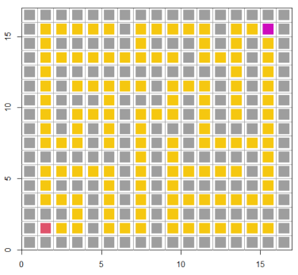
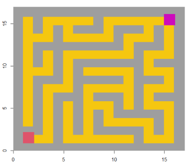

#Introduction

Usually we use R programming for statistical analysis, for classification algorithm, for data visualization. However, R is rarely used to program games.The goal of litteGames is to provide access to games in order to spend some fun times in RStudio. You can play maze, guess number, and more games are coming. 

#Installation

```{r setup}
#install.packages("devtools")
#devtools::install_github("kamanso/littleGames")
```

#Maze game

The first value of the function about the total size of the maze matrix. Fox example, the size= 10,then the maze matrix is (10x2-3)x(10x2-3)=17x17. 
```{r}
library(littleGames)
maze(size=10, cex_set=5)
```

Because the color filling of maps of different scales may not be good, either not filling most of the area, or exceeding the area to affect the normal game operation, so the size of the cex_set setting point is left for the user to adjust. Compare to these two maze, which have the same size, the filling color in cex_set=3 maze map is not good, but the cex_set=5 maze map is quite well. This is also the limitation need to be modify later. 
```{r}


```

#Guess number game 

First set up the guessing range a and b. Then type any number and double click enter. If the given number is wrong, then it will return "Wrong answer, please enter another number between 'a' and 'b'.". Otherwise, the given number is correct, it will return "Congratulation! You win!!! The answer is xxx".
```{r}
guessNum(a=0,b=100)
```

#Future Work and Plans

In this project, I found that R not only for our work, our study, also can be make some fun to our life. So in the future, I hope I can use R to create more little games. For now, the main limitation in my project is
1.the maze game is not exquisite enough, it is very base one. Regarding coloring, I plan to use function {polygon}, it should be able to improve the color filling.
2.generates multiple shapes mazes , such as polygon and animal shape. Add another parameter {shape} to the function.
3.guessNum is simple number game, consider using the {gapminder} and {gganimate} package to add some playfulness.

